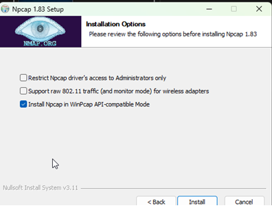
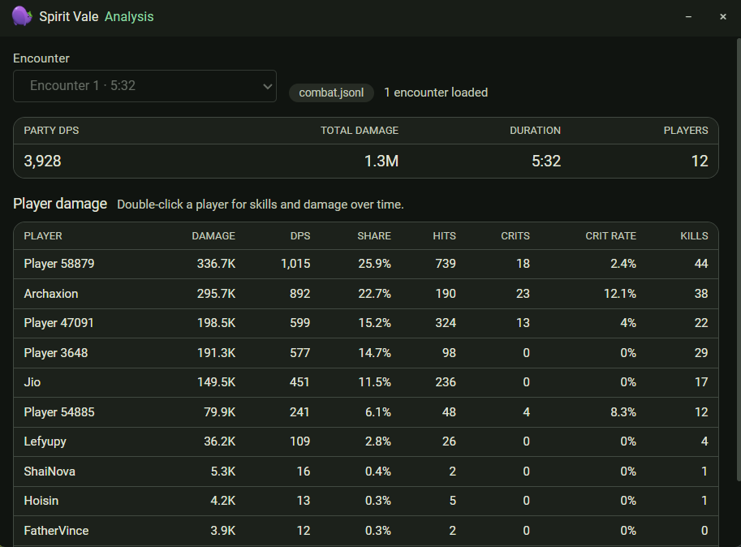
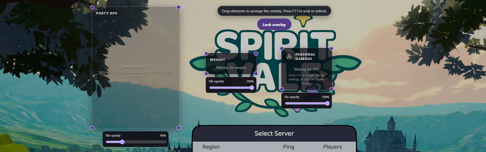
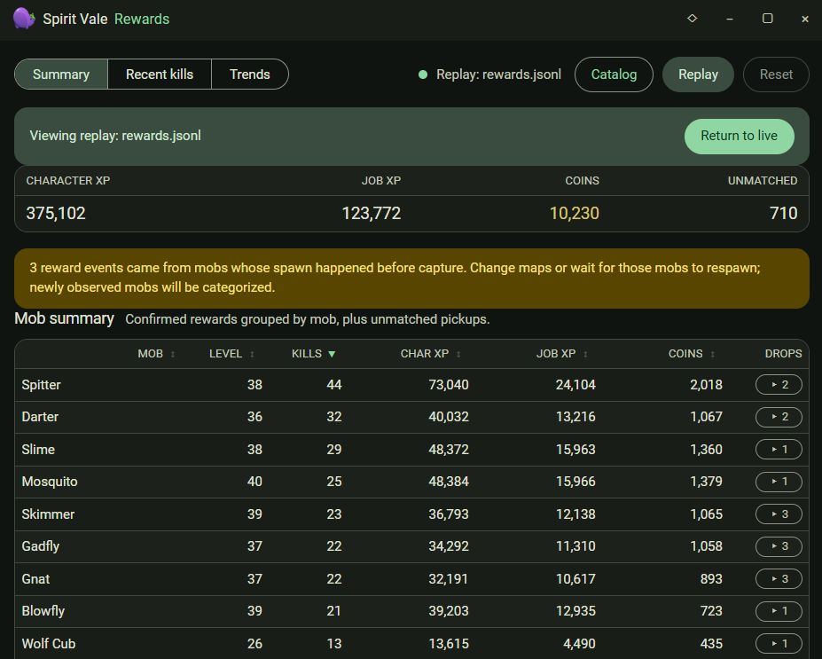

# Spirit Vale Tools

Spirit Vale Tools is a passive Windows companion app for viewing live combat,
character, reward, and market information. It uses your existing Npcap
installation in non-promiscuous mode and never sends, modifies, drops, or
injects game traffic.

## Prerequisites

- Windows 10 or 11 (x64)
- A current [Npcap](https://npcap.com/#download) installation
  - Select **Install Npcap in WinPcap API-compatible Mode**.
  - Leave **Restrict Npcap driver's access to Administrators only** unchecked.



## Installation

### Portable release

1. Download the latest `Spirit-Vale-portable-win-x64-v*.zip` from
   [GitHub Releases](https://github.com/kar-mi/spirit-vale-tools/releases/latest).
2. Extract the entire ZIP.
3. Run the top-level `Spirit Vale.exe`.

Npcap is installed separately. The portable app keeps its settings, logs, and
other writable data inside the extracted folder.

### Run from source

[Bun 1.3 or newer](https://bun.sh/) is required.

```powershell
bun install
bun run dev
```

To verify or build the project:

```powershell
bun run check
bun run build
```

## Features

### Combat

Live DPS tracking, encounter summaries, player analysis, and combat-log replay.



### Overlay

Customizable in-game DPS and character-stat displays with a click-through
locked mode.



### Rewards

Confirmed kill history, session totals, trends, and a searchable mob reward
catalog.



### Market

Locally browse, search, filter, and sort captured market listings.

### Character

View your build, equipment, skills, and calculated stats.

### Passive capture

Reads existing game traffic through Npcap without sending or altering traffic.

Detailed feature behavior, command-line tools, logging, and protocol references
are available in the [documentation](docs/README.md).
