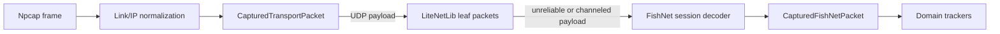

# Packet decoding

This guide describes the UDP decoding path implemented by `@spiritvale/core`.
It is a parser for packets already observed by passive capture; it is not a
network client and does not participate in a game connection.

## Decode pipeline



`PacketCapture` emits transport packets only after it has normalized supported
link-layer frames, parsed IPv4 or IPv6 plus TCP or UDP, and (when configured)
attributed the endpoint to the target process. `CapturedUdpPacket` preserves the
transport metadata and exposes the UDP bytes as `payload`.

LiteNetLib and FishNet decoding are opt-in. `decodeFishNet: true` also enables
LiteNetLib decoding. A malformed payload produces a capture `warning`; it does
not stop processing later packets.

## LiteNetLib datagrams

The first byte of every LiteNetLib packet is interpreted as follows:

| Bits | Meaning |
| --- | --- |
| 0–4 | packet property ID |
| 5–6 | connection number |
| 7 | fragmentation flag; valid only for a channeled packet |

The decoder recognizes the LiteNetLib 1.x property IDs exposed by
`LiteNetLibPacketProperty`. Its ordinary leaf forms are:

| Property | Header after the first byte | Payload begins |
| --- | --- | --- |
| `unreliable` | none | byte 1 |
| `channeled` | sequence `u16le`, channel `u8` | byte 4 |
| fragmented `channeled` | plus fragment ID, part, and total, each `u16le` | byte 10 |
| `ack` | sequence `u16le`, channel `u8` | byte 4 |
| `ping` | sequence `u16le` | byte 3 |
| `pong` | sequence `u16le`, timestamp `i64le` | byte 11 |
| control properties | none | byte 1 |

The `merged` property is an envelope, not an emitted leaf. Its body is a
sequence of `u16le` child lengths followed by child bytes. The decoder walks
these recursively and emits one `DecodedLiteNetLibPacket` for every leaf. Its
`mergePath` records the zero-based child indexes from the outer envelope to that
leaf. Empty children, truncated children, invalid flags, unknown property IDs,
and nesting deeper than 32 levels are rejected.

Fragmented channeled packets expose `fragment` metadata, but LiteNetLib
fragment reassembly is intentionally not performed here. Only each observed
transport leaf is emitted.

## FishNet messages

A FishNet transport payload starts with a common prefix:

| Offset | Bytes | Value |
| --- | --- | --- |
| 0 | 4 | tick (`u32le`) |
| 4 | 2 | packet ID (`u16le`) |
| 6 | remaining | packet-specific data |

One transport payload can contain a bundle of FishNet messages. The session
decoder returns one `DecodedFishNetPacket` per message only while a message
length or verified packet boundary makes the next boundary safe. If parsing a
message fails, the remaining data is retained as one opaque packet instead of
guessing a boundary.

For fixed RPC packets (`serverRpc`, `observersRpc`, and `targetRpc`), the
decoder reads the network-object reference, spawned flag, behaviour index, and
RPC hash. Reliable packets also carry a packed payload length, which makes a
bundle boundary explicit. The `reliable` option must match the LiteNetLib
property: channeled packets are reliable; unreliable packets are not.

`FishNetSessionDecoder` keeps state per `connectionId`:

- Object spawns register component types and RPC Link entries; despawns remove
  that object’s registrations.
- RPC Link packets resolve through those registrations to the original RPC
  kind, object, component, and wire hash.
- Split packets are accumulated separately by connection, direction, channel,
  tick, and chunk count. Duplicated reliable sequence numbers are ignored and
  complete chunks are ordered with 16-bit sequence wraparound awareness.
- Authentication and disconnect clear relevant session state. Split assemblies
  are bounded by chunk count, total size, and concurrent assemblies; a dropped
  assembly is emitted with `splitDropReason`.

The standalone `decodeFishNetPayload` API is intentionally strict and stateless
for a single message. Use `decodeFishNetBundle` for safely delimited bundles,
or retain one `FishNetSessionDecoder` per replay/live capture when link and
split state matters.

## Map-based resolution and fields

`FishNetRpcMap` is build-fingerprinted metadata. It declares behaviours, RPC
wire hashes and packet kinds, SyncTypes, broadcasts, and optional generated
writer codecs. `PacketCapture` selects the current bundled map by default when
FishNet decoding is enabled; `fishNetBuildFingerprint` chooses another bundled
map, while `fishNetRpcMap` supplies an in-memory override.

Resolution is deliberately conservative:

- `rpcName` and decoded fields appear only when the behaviour, RPC kind, and
  compact wire hash select a verified definition.
- A fixed RPC can infer a behaviour only when the map yields one candidate.
- Ambiguous or unknown links stay numeric and expose `rpcResolution` rather
  than a guessed name.
- `decodedFields` contain only fields whose exact codecs are known. The
  remaining bytes stay available as `undecodedPayload` or `payload`.

The build fingerprint is an offline compatibility key for maps and catalogs;
it is not sent on the network or required by FishNet connection setup.

## Output types and extension points

The public type hierarchy is:

```text
CapturedTransportPacket
├─ CapturedTcpPacket
└─ CapturedUdpPacket
   └─ CapturedLiteNetLibPacket
      └─ CapturedFishNetPacket
         (also includes every DecodedFishNetPacket field)
```

`CapturedLiteNetLibPacket` pairs a decoded leaf with its source UDP packet.
`DecodedFishNetPacket` contains protocol-level fields such as `tick`,
`packetId`, `packetName`, raw bytes, decoded payload, optional object/component
metadata, and optional resolution data. `CapturedFishNetPacket` adds the source
LiteNetLib leaf and stable transport `connectionId`.

When extending support, keep responsibilities separate:

- Add a verified wire layout or parser to `@spiritvale/core`.
- Add build-scoped RPC, SyncType, broadcast, or codec metadata to the FishNet
  map definitions when the exact wire representation is known.
- Add game-feature interpretation in the relevant domain package, consuming
  `DecodedFishNetPacket` or `CapturedFishNetPacket` without duplicating
  transport parsing.
- Use synthetic bytes and fictional identifiers in tests and documentation;
  do not add capture-derived fixtures.
