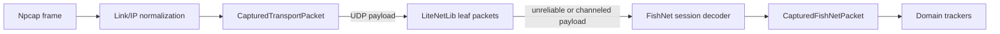

# Packet decoding

This guide describes the UDP decoding path implemented by `@kar-mi/spirit-vale-tools-capture`.
It is a parser for packets already observed by passive capture; it is not a
network client and does not participate in a game connection.

## Decode pipeline



`PacketCapture` emits transport packets only after it has normalized supported
link-layer frames, parsed IPv4 or IPv6 plus TCP or UDP, and (when configured)
attributed the endpoint to the target process. `CapturedUdpPacket` preserves the
transport metadata and exposes the UDP bytes as `payload`.

LiteNetLib and FishNet decoding are opt-in. `decodeFishNet: true` also enables
LiteNetLib decoding. A malformed payload produces a capture `warning`; it does
not stop processing later packets.

## LiteNetLib datagrams

The first byte of every LiteNetLib packet is interpreted as follows:

| Bits | Meaning |
| --- | --- |
| 0–4 | packet property ID |
| 5–6 | connection number |
| 7 | fragmentation flag; valid only for a channeled packet |

The decoder recognizes the LiteNetLib 1.x property IDs exposed by
`LiteNetLibPacketProperty`. Its ordinary leaf forms are:

| Property | Header after the first byte | Payload begins |
| --- | --- | --- |
| `unreliable` | none | byte 1 |
| `channeled` | sequence `u16le`, channel `u8` | byte 4 |
| fragmented `channeled` | plus fragment ID, part, and total, each `u16le` | byte 10 |
| `ack` | sequence `u16le`, channel `u8` | byte 4 |
| `ping` | sequence `u16le` | byte 3 |
| `pong` | sequence `u16le`, timestamp `i64le` | byte 11 |
| control properties | none | byte 1 |

The `merged` property is an envelope, not an emitted leaf. Its body is a
sequence of `u16le` child lengths followed by child bytes. The decoder walks
these recursively and emits one `DecodedLiteNetLibPacket` for every leaf. Its
`mergePath` records the zero-based child indexes from the outer envelope to that
leaf. Empty children, truncated children, invalid flags, unknown property IDs,
and nesting deeper than 32 levels are rejected.

Fragmented channeled packets expose `fragment` metadata, but LiteNetLib
fragment reassembly is intentionally not performed here. Only each observed
transport leaf is emitted.

## FishNet messages

A FishNet transport payload starts with a common prefix:

| Offset | Bytes | Value |
| --- | --- | --- |
| 0 | 4 | tick (`u32le`) |
| 4 | 2 | packet ID (`u16le`) |
| 6 | remaining | packet-specific data |

One transport payload can contain a bundle of FishNet messages. The session
decoder returns one `DecodedFishNetPacket` per message only while a message
length or verified packet boundary makes the next boundary safe. If parsing a
message fails, the remaining data is retained as one opaque packet instead of
guessing a boundary.

For fixed RPC packets (`serverRpc`, `observersRpc`, and `targetRpc`), the
decoder reads the network-object reference, spawned flag, behaviour index, and
RPC hash. Reliable packets also carry a packed payload length, which makes a
bundle boundary explicit. The `reliable` option must match the LiteNetLib
property: channeled packets are reliable; unreliable packets are not.

An ObjectSpawn's transform header is read rather than skipped. Its position and scale are three
little-endian `float32` values each, exposed as `spawnLocalPosition` and `spawnLocalScale`. Rotation
is exposed as `spawnLocalRotation` only in the uncompressed 16-byte quaternion form; the 4- and
8-byte packings are traversed to find the following fields but left undecoded.

A SyncType body can carry several SyncTypes in sequence, each an index byte followed by its value.
Every entry whose layout is known is decoded, and they appear in wire order as `syncEntries` with
their fields concatenated into `decodedFields`. The walk stops at the first entry that cannot be
resolved or does not decode cleanly, leaving the remainder as `undecodedPayload` rather than
guessing where the next boundary is. `syncIndex` and `syncName` continue to describe the first
entry.

An ObjectSpawn carries its own initial SyncTypes, decoded as `spawnSyncEntries`. That body is framed
differently from a standalone SyncType packet, whose header already names one component: a spawn
covers several, so each run is a component index, a count, and then that many index-prefixed values.
A component whose behaviour is unknown ends the walk, because its values cannot be sized and the
next component's boundary is therefore unknowable.

`FishNetSessionDecoder` keeps state per `connectionId`:

- Object spawns register component types and RPC Link entries. Instantiated
  spawns may also recover missing component bindings from the RPC map's
  build-scoped prefab metadata; despawns remove that object’s registrations.
- RPC Link packets resolve through those registrations to the original RPC
  kind, object, component, and wire hash.
- Split packets are accumulated separately by connection, direction, channel,
  tick, and chunk count. Duplicated reliable sequence numbers are ignored and
  complete chunks are ordered with 16-bit sequence wraparound awareness.
- Authentication and disconnect clear relevant session state. Split assemblies
  are bounded by chunk count, total size, and concurrent assemblies; a dropped
  assembly is emitted with `splitDropReason`.

The standalone `decodeFishNetPayload` API is intentionally strict and stateless
for a single message. Use `decodeFishNetBundle` for safely delimited bundles,
or retain one `FishNetSessionDecoder` per replay/live capture when link and
split state matters.

## Map-based resolution and fields

`FishNetRpcMap` is build-fingerprinted metadata. It declares behaviours, RPC
wire hashes and packet kinds, SyncTypes, broadcasts, and optional generated
writer codecs. `PacketCapture` selects the current bundled map by default when
FishNet decoding is enabled. `fishNetBuildFingerprint` validates the requested
bundled build, while `fishNetRpcMap` supplies an in-memory override. Bundled
metadata supports only the current game build.

Resolution is deliberately conservative:

- `rpcName` and decoded fields appear only when the behaviour, RPC kind, and
  compact wire hash select a verified definition.
- A prefab layout is keyed by spawnable collection ID plus prefab ID inside the
  already build-fingerprinted RPC map. It is used only for instantiated spawns.
  A component type absent from the map, a duplicate layout, or any conflict
  with that spawn's RPC Link registrations rejects recovery. Wire registrations
  always win.
- A fixed RPC can infer a behaviour only when the map yields one candidate.
- A component on an object whose spawn was never captured may be recovered from
  the prefab layouts, but only where the object's own already-verified bindings
  narrow the candidates and every survivor names the same type for that index.
  Recovery needs at least one verified binding to narrow from, every surviving
  layout must define the wanted index, and they must agree; a layout that
  contradicts a known binding is discarded, and one that leaves the index blank
  abandons the attempt. This is what makes a capture that attaches mid-session
  usable: nothing registers the local player's layout, so without it every
  packet on its other components stays unresolved for the whole session.
- Ambiguous or unknown links stay numeric and expose `rpcResolution` rather
  than a guessed name.
- `decodedFields` contain only fields whose exact codecs are known. The
  remaining bytes stay available as `undecodedPayload` or `payload`.

The build fingerprint is an offline compatibility key for maps and catalogs;
it is not sent on the network or required by FishNet connection setup.

### Bundled prefab layouts

The current build includes these verified default-collection layouts. Blank
positions are intentionally unknown rather than inferred:

| Prefab | Name | Component indexes |
| --- | --- | --- |
| 0 | `LootDrop` | `0 LootDrop` |
| 1 | `PlayerClone` | `0 PlayerController`, `1 MoveComponent`, `2 HealthComponent`, `3 CombatComponent`, `4 SkillsComponent`, `5 StatusComponent`, `6 SummoningComponent`, `7 PlayerSave`, `8 NetworkTransform` |
| 2 | `SkillInstance` | `1 NetworkTransform` |
| 4 | `Player` | `0 PlayerController`, `1 MoveComponent`, `2 HealthComponent`, `3 CombatComponent`, `4 SkillsComponent`, `5 StatusComponent`, `6 SummoningComponent`, `7 PlayerSave`, `8 NetworkTransform` |
| 5 | `Monster` | `0 MonsterController`, `1 NetworkTransform`, `2 MoveComponent`, `3 HealthComponent`, `4 CombatComponent`, `5 SkillsComponent`, `6 StatusComponent`, `7 SummoningComponent` |

The mapping is copied from the matched data-mine build's serialized
`NetworkObject` component layouts, then checked against its RPC and SyncType
metadata. Prefab 0 is wire-known through `LootDrop`'s two SyncVars even though
that behaviour has no RPCs. Blank component slots and prefab 3
(`BossGravestone`, whose only behaviour has no wire metadata) remain unknown.
This is metadata for this build only: changing the
game-build fingerprint selects a different RPC map and cannot reuse these
indexes accidentally.

Prefab IDs are wire values and are reassigned between builds — this build moved
the player clone from 3 to 1 and `SkillInstance` from 1 to 2. Nothing outside
the map should hardcode one. `Player` and `PlayerClone` are byte-identical in
layout, so `prefabName` is the only way to tell them apart.

Both count as player-owned objects. A clone is a second network object under
its owner's connection and deals damage under its own `AttackerId`, so treating
only `Player` as a player leaves that damage on an anonymous actor. Counting
both does not split a player in two: the actor directory propagates one identity
across every object of an owner, and the meter folds those aggregates back
together by display name.

### Eternal Tower state

`ETUpdateRun`/`ETAdvanceFloor` (`PlayerController` wireHash 95/96) are still
present in the generated rpc map - scraped from the live assembly, so the
methods still exist - but do not appear anywhere in real Eternal Tower
captures spanning entry, a mid-tower session, and multiple floor transitions.
`FishNetEternalTowerTracker` instead follows the mechanism the client-side
ISIL actually exercises: `PlayerController.DrawTitle`, a targetRpc that
broadcasts a title banner (`"<tower name>\nFloor <n>"`, e.g. `"The Echoing
Spire\nFloor 12"`), and `PlayerController.ClientInstancedMapReady`, which
confirms the instanced map the client is bound to and carries its instance id
- discriminated from an ordinary instanced map by `bindingSlot === "et"`.

The tracker does not reset on `authenticated`/`disconnect`. A capture spanning
a mid-run crash and reload showed the client re-authenticate on the same
floor at least once with neither RPC repeating - the server does not
re-announce a floor the client is merely reattaching to. Floor/tower state is
instead only cleared by positive evidence of leaving: a
`ClientInstancedMapReady` whose `bindingSlot` is not `"et"`.

Caveat: the title string was composed in a single fixed locale (English,
"Floor N") in every capture available. If the server localizes this banner
per client, a non-English client's floor would fail to parse - there is no
numeric-only floor field on the wire to fall back to.

## NetworkTransform updates

`NetworkTransform`'s three movement RPCs — `TargetUpdateTransform`,
`ObserversUpdateClientAuthoritativeTransform`, and `ServerUpdateTransform` — declare a bare
`ArraySegment<byte>`, so the generated map cannot describe their contents. Their layout is fixed by
FishNet rather than by the game build, so it is parsed directly and exposed as `networkTransform`.

The segment is a packed length followed by one update:

| Offset | Field |
| --- | --- |
| 0 | update flags `u8` |
| then | position axes the flags select |
| then | rotation, when flag `0x40` is set |
| then | extension flags `u8`, when flag `0x80` is set |
| then | scale axes the extension flags select |
| then | parent NetworkBehaviour, when extension flag `0x40` is set |

Each axis owns two flag bits — `0x01`/`0x02` for X, `0x04`/`0x08` for Y, `0x10`/`0x20` for Z. The
first selects a signed 16-bit whole divided by 100; the second a full `float32`, which the sender
uses when the scaled value would not fit. Neither bit means the axis was not resent and keeps its
previous value, so an update is usually a partial position rather than a whole one. Positions are
absolute, not deltas, so reading one needs no carried baseline.

Rotation is a quaternion whose packing is a component setting rather than a wire field, so only its
width is reported, as `rotationBytes`. Where no extension byte follows, the width is whatever the
segment has left and is therefore exact; where one does, only a width that lands the rest of the
entry precisely on its end is accepted, and an ambiguous fit is rejected.

Exactly one update is read per payload. Bytes after the segment are retained as `undecodedPayload`:
in the observed build they are further bundled messages that could not be split, not additional
updates, and reading them as updates yields out-of-world coordinates.

For turning these partial updates into whole positions, see
[positions and ground loot](../positions.md).

## Output types and extension points

The public type hierarchy is:

```text
CapturedTransportPacket
├─ CapturedTcpPacket
└─ CapturedUdpPacket
   └─ CapturedLiteNetLibPacket
      └─ CapturedFishNetPacket
         (also includes every DecodedFishNetPacket field)
```

`CapturedLiteNetLibPacket` pairs a decoded leaf with its source UDP packet.
`DecodedFishNetPacket` contains protocol-level fields such as `tick`,
`packetId`, `packetName`, raw bytes, decoded payload, optional object/component
metadata, and optional resolution data. `CapturedFishNetPacket` adds the source
LiteNetLib leaf and stable transport `connectionId`.

When extending support, keep responsibilities separate:

- Add a verified wire layout or parser to `@kar-mi/spirit-vale-tools-capture`.
- Add build-scoped RPC, SyncType, broadcast, or codec metadata to the FishNet
  map definitions when the exact wire representation is known.
- Add game-feature interpretation in the relevant domain package, consuming
  `DecodedFishNetPacket` or `CapturedFishNetPacket` without duplicating
  transport parsing.
- Use synthetic bytes and fictional identifiers in tests and documentation;
  do not add capture-derived fixtures.
